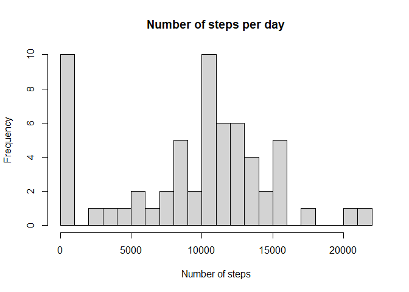
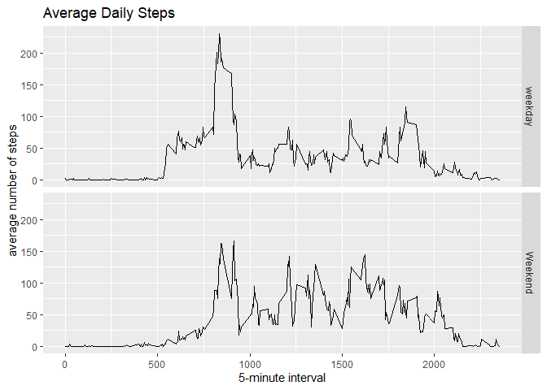

## Loading and preprocessing the data
1.Unzip the file and load the data


``` r
unzip("activity.zip")
Data <- read.csv("activity.csv",header = TRUE)
```

2.Data processing - formatting the date data


``` r
Data$date <- as.Date(Data$date, "%Y-%m-%d")
```


## What is mean total number of steps taken per day?  

1.Calculate the total number of steps taken per day.


``` r
library("dplyr")
Tsteps <- Data %>% group_by(date) %>% summarise(total = sum(steps, na.rm=TRUE))
```

2.Make a histogram of the total number of steps taken per day


``` r
hist(Tsteps$total, xlab= "Number of steps", main = "Number of steps per day", breaks = 20)
```

<!-- -->

3.Calculate and report the mean and median of the total number of steps taken per day


``` r
summary(Tsteps$total)
```

```
##    Min. 1st Qu.  Median    Mean 3rd Qu.    Max. 
##       0    6778   10395    9354   12811   21194
```

Based on the results, the mean is 9354 steps and the median is 10395 steps.


## What is the average daily activity pattern?

1.Make a time series plot of the 5-minute interval (x-axis) and the average number of steps taken, averaged across all days (y-axis)


``` r
int_steps <- Data %>% group_by(interval) %>% summarise(int_total = sum(steps, na.rm = TRUE))

with(int_steps, plot(interval, int_total, type = "l", xlab = "5-min interval", ylab = "Average number of steps daily"))  
```

<!-- -->

2.Which 5-minute interval, on average across all the days in the dataset, contains the maximum number of steps?


``` r
int_steps[which.max(int_steps$int_total),]
```

```
## # A tibble: 1 × 2
##   interval int_total
##      <int>     <int>
## 1      835     10927
```

Based on the results, the maximum number of steps (10927 steps) occurred in the 835 interval.

## Imputing missing values

1.Calculate and report the total number of missing values in the dataset


``` r
sum(is.na(Data$steps))
```

```
## [1] 2304
```

2.Devise a strategy for filling in all of the missing values in the dataset.\
(Use the mean steps of each 5-min interval to replace the missing values)


``` r
int_meansteps <- Data %>% group_by(interval) %>% summarise(Mean = mean(steps, na.rm=TRUE))
Data$int_mean <- int_meansteps[match(Data$interval,int_meansteps$interval),"Mean"]

Data$imp_steps <- as.numeric(is.na(Data$steps)) * Data$int_mean +ifelse(is.na(Data$steps),0,Data$steps)
```

3.Create a new dataset that is equal to the original dataset but with the missing data filled in.


``` r
Data_imp <- Data
Data_imp$steps <- Data_imp$imp_steps
Data_imp <- Data_imp[,1:3]
Data_imp$steps <- as.numeric(unlist(Data_imp$steps))
```

4.Make a histogram of the total number of steps taken each day and Calculate and report the mean and median total number of steps taken per day. Do these values differ from the estimates from the first part of the assignment? What is the impact of imputing missing data on the estimates of the total daily number of steps?


``` r
Tsteps_imp <- Data_imp %>% group_by(date) %>% summarise(total = sum(steps))

hist(Tsteps_imp$total, xlab= "Number of steps", main = "Number of steps per day", breaks = 20)
```

<!-- -->


``` r
summary(Tsteps)
```

```
##       date                total      
##  Min.   :2012-10-01   Min.   :    0  
##  1st Qu.:2012-10-16   1st Qu.: 6778  
##  Median :2012-10-31   Median :10395  
##  Mean   :2012-10-31   Mean   : 9354  
##  3rd Qu.:2012-11-15   3rd Qu.:12811  
##  Max.   :2012-11-30   Max.   :21194
```

``` r
summary(Tsteps_imp)
```

```
##       date                total      
##  Min.   :2012-10-01   Min.   :   41  
##  1st Qu.:2012-10-16   1st Qu.: 9819  
##  Median :2012-10-31   Median :10766  
##  Mean   :2012-10-31   Mean   :10766  
##  3rd Qu.:2012-11-15   3rd Qu.:12811  
##  Max.   :2012-11-30   Max.   :21194
```
Based on the results, the mean steps for the original and the imputated dataset are 9354 and 84188, respectively. The median steps for the original and the imputated dataset are 10395 and 11458, respectively.

Imputating the missing data may overestimate the total daily number of steps.

## Are there differences in activity patterns between weekdays and weekends?  

Use the dataset with the filled-in missing values for this part.

1.Create a new factor variable in the dataset with two levels – “weekday” and “weekend” indicating whether a given date is a weekday or weekend day.


``` r
Data_imp$day <- weekdays(Data_imp$date)
Data_imp$DayType <- ifelse(Data_imp$day %in% c("Saturday", "Sunday"), "Weekend", "weekday")
```

2.Make a panel plot containing a time series plot of the 5-minute interval (x-axis) and the average number of steps taken, averaged across all weekday days or weekend days (y-axis).


``` r
Data_imp$steps <- as.numeric(unlist(Data_imp$steps))
Tsteps_imp_DT <- Data_imp %>% group_by(DayType, interval) %>% summarise(Mean = mean(steps))
```


``` r
library("ggplot2")
par(mfrow=c(2,1), mar=c(5,4,1,1))

ggplot(Tsteps_imp_DT, aes(interval, Mean))+geom_line()+xlab("5-minute interval")+ylab("average number of steps")+ggtitle("Average Daily Steps")+facet_grid(DayType~.)
```

<!-- -->

